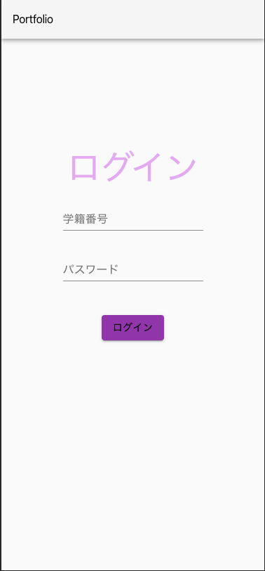
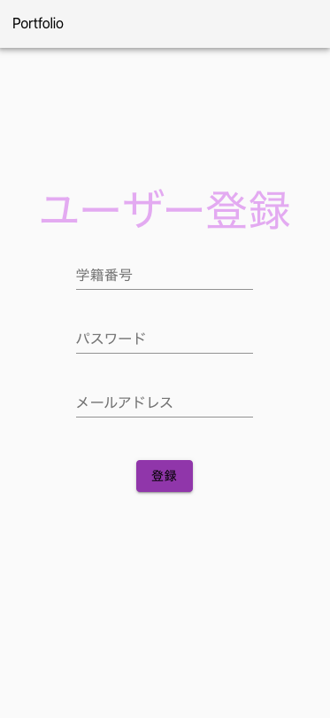
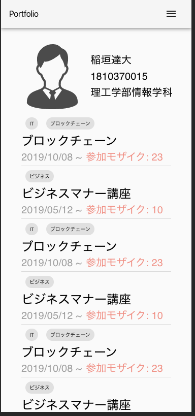
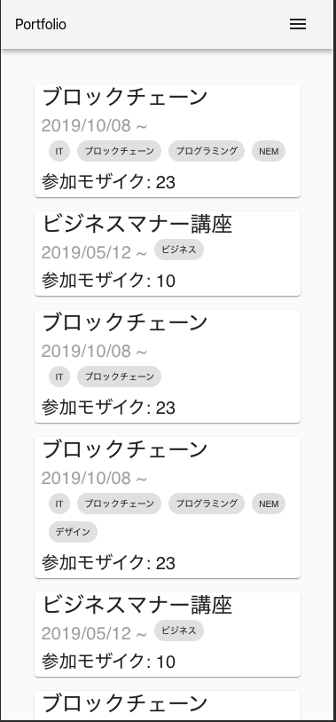
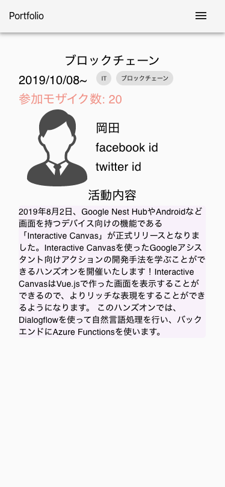
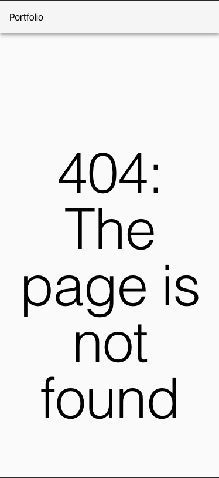

# Nem Portfolio Service (StudentView)

近畿大学ACTプロジェクト ブロックチェーンサービス開発プロジェクトにて作成しているNEMを用いた課外活動の自己証明をする

Portfolioサービスの学生用画面のリポジトリ

# DEMO
サインインページ /sign-in

サインアップページ /sign-up

マイページ /mypage

イベントリストページ /events

イベントページ /event:id

404エラーページ /not-found

# Library・FrameWork
- react
- clsx
- material-ui

